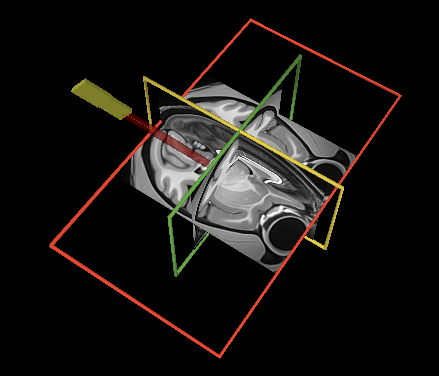
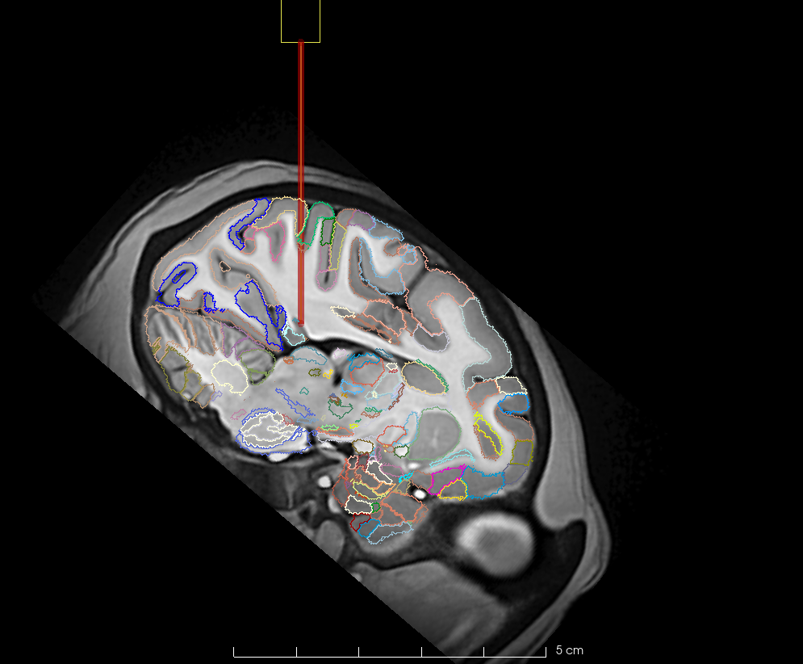

# How to use NHP-NeuroCarto
## Plan an insertion trajectory in 3D Slicer
The folder `Slicer_utilities` in this repository contain several tools you can use for planning with Slicer.
- `NHP-NP.vtk` is a mesh model of a long NHP neuropixels probe with its tip at coordinate (0,0,0 RSA) and the shank going straight up.
- `NP_trajectory.mrk.json` is a Slicer markups line that aligns with the model shank of the probe.

### Find your trajectory in Slicer
- **Step 1**: Create a transform for the probe model and trajectory line.



- **Step 2**: Use the transform to place the model and line where you want your electrode.
- **Step 3**: Invert the transform and put the model and line back in their original position by removing them from the list of nodes the transform is applied to.
- **Step 4**: Transiently apply (no hardening) the inverted transform to whatever you would like to see in Neurocarto, typically the anatomy and maybe an atlas. This brings the background information in an orientation that is compatible with Neurocarto.
- **Step 5**: Pick slices where the probe & line are visible, either manually or with the `Stereotaxia >> Probe View` module.
- **Step 6**: Create a screenshot of an informative slice (typically something close to coronal or sagittal). Include a scale bar in the screen shot, because you need it to scale the image in Neurocarto. NHP-Neurocarto will initially assume that your screenshot has a width corresponding to about 10 cm. You can scale this later but it helps to be in the correct range from the start.



## Make a channel selection in NHP-NeuroCarto
- **Step 1**: launch NHP-NeuroCarto without atlases and with the screenshot as a background imgage. This should launch a UI in your default web browser.

```bash
neurocarto --view=$PathToYourScreenshot
```


- **Step 2**: Note that the axes is in um and your screen shot does not have the correct size. The image should have a default width of 10 cm or 10.000 um. Use the image scale slider and the correspondence between your scale bar and axis to set the image to the correct size. It could help to move the image around. You can do this with the tool in the top right. Not that the drag tool only drags the image if you immediately move the mouse after clicking. If you wait a bit longer you'll see a new rectangle that gets created and the image will be rescaled and moved to this reactangle. This takes some getting used to.
- **Step 3**: Load your NHP probe template with the 'New' button.
- **Step 4**: Use the Alpha slider on the right to control the transparancy of the screenshot image so that you can see both the planned probe and the channel template. Now move the screenshot image so that it aligns with the trajectory line you planned in slicer.


- **Step 5**: You can now use Neurocarto's channel selection tools to create a channelmap. For additional NeuroCarto functionality, see the [wiki](https://github.com/AntonioST/NeuroCarto/wiki) on the original repository, or [the paper](https://doi.org/10.1007/s12021-024-09705-2).


- **Step 6**: When you're happy with the channelmap you can save it using the `save` button. The files will be saved to the directory you launched NeuroCarto from.